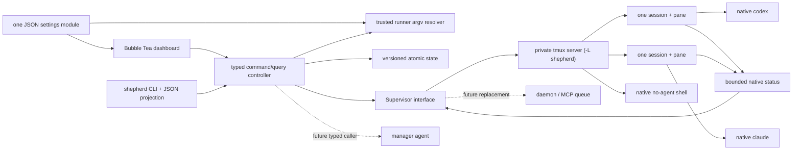

# Shepherd design

## Product thesis

The fastest useful parallel-agent system is not a new agent runtime. It is a
high-quality control surface over the native runners people already trust.

Shepherd V0 therefore optimizes one loop:

1. See every coding-agent session in one scan-friendly view.
2. Dispatch a new task without leaving the composer.
3. Preview and steer an existing session without opening it.
4. Attach to the exact native Codex or Claude terminal when full control is
   useful.
5. Detach back to the global view without stopping anything.

Durable workstreams now organize that loop without changing its execution
substrate. New sessions also install bounded runner-native status publishers;
richer orchestration remains a future caller of the same controller actions,
not a prerequisite for using the dashboard.

## Research synthesis

### Claude Code Agent view

The closest production reference is Claude Code's [`claude agents` Agent
view](https://code.claude.com/docs/en/agent-view), not the in-session `/agents`
panel or experimental agent teams. Its strongest choices are:

- a sparse, full-terminal global list across directories;
- an always-available dispatch input at the bottom;
- action-oriented status ordering, with “needs input” prominent;
- a lightweight peek/reply layer before full attachment;
- direct attachment to the native conversation; and
- background work that survives leaving the dashboard.

Anthropic's implementation has a per-user supervisor and structured semantic
state, so Shepherd cannot honestly reproduce all its statuses from tmux alone. The
V0 copies the interaction loop rather than pretending to copy the substrate.
Anthropic's [launch post](https://claude.com/blog/agent-view-in-claude-code) is
also useful visual evidence: compact rows, restrained status color, and almost
no card chrome.

### `zwarm`

The intended package appears to be [`zwarm`](https://pypi.org/project/zwarm/),
invoked as `uvx zwarm interactive`; the literal PyPI package named `swarm` is an
unrelated game. `zwarm` contributes useful vocabulary—spawn, list, peek, show,
watch, continue, kill—and a clean runner-adapter idea.

Its execution substrate is intentionally not reused. It launches headless
one-shot processes, redirects JSONL, and reconstructs follow-up context. That
makes raw native attachment and steering a running turn impossible. Shepherd
inverts the design: the PTY-backed native session is truth, and structured logs
can become an optional observer later.

### TUI stack

Go plus [Bubble Tea v2](https://pkg.go.dev/charm.land/bubbletea/v2) is the right
V0 tradeoff:

- a single, quickly starting binary;
- an Elm-style state/update/view split;
- declarative alternate-screen and keyboard behavior; and
- `ExecProcess`, which suspends the dashboard, lends the terminal to tmux, and
  restores the dashboard afterward.

Rust with Ratatui/Crossterm remains a credible eventual foundation if profiling
or deeper terminal control justifies the extra implementation surface. The
runtime boundary below is intentionally independent of Bubble Tea.

## Architecture

The package boundaries are:

- `internal/shepherd`: runner-neutral session types and the `Supervisor`
  contract;
- `internal/env`: every environment variable name Shepherd reads or sets, so that
  one list answers which variables it honours;
- `internal/format`: the presentation helpers every surface shares — elapsed
  time, abbreviated ids, shortened paths, and text made safe to print on one
  line;
- `internal/home`: the one directory holding every Shepherd file;
- `internal/config`: the single JSON settings model and strict loader;
- `internal/brief`: the session-row summary, its ordered source layout, and the
  observer that reads transcripts and runs configured command sources off the
  render path;
- `internal/workstream`: durable workstream/session/membership types and the
  versioned atomic store;
- `internal/control`: the sole join between durable organization and current
  runtime observation, including the closed typed actor/scope command plane;
- `internal/runner`: Codex and Claude argv adapters, launch-time native-status
  instrumentation, and the exec wrapper;
- `internal/supervisor`: the tmux implementation and ephemeral native-status
  transport;
- `internal/autotitle`: the optional, single-purpose GPT-5.6 Luna Responses
  client used by the dashboard;
- `internal/transcript`: the read-only observer for what a native runner
  recorded about a session — the whole conversation as turns, and the tail of it
  as the one thing the session was last doing;
- `internal/ui`: typed screen reducers, their shared overview read model, and
  rendering; and
- `cmd/shepherd`: human-facing CLI commands and dependency diagnostics.

`internal/env`, `internal/format` and `internal/shepherd` are leaves: they import
nothing else in the module, so any layer may use them and none can create a
cycle. That ordering is not a convention to remember — `internal/architecture`
declares it and fails the build when a new import contradicts it.

There is no Shepherd daemon in V0. The private tmux server already provides the
needed process lifetime and PTY ownership. It is isolated from the user's normal
tmux server and configured with zero-session persistence.

### Typed command plane

Every current human mutation enters `Controller.Execute` as a closed Go action
with an explicit actor and either installation or workstream scope. Convenience
methods used by the TUI and CLI construct the same `local_human` command rather
than bypassing that boundary. Structural validation runs before authorization,
and the default authorizer admits only the local human. A session actor is a
modeled future caller but is rejected until manager grants and their policy
exist.

This is deliberately a local in-process boundary, not yet a durable command
queue. There are no manager grants, command IDs, approvals, events, leases, or
outbox semantics in V0.3.4. Adding those later should strengthen this one path,
not create a manager-only mutation API.

Launch actions choose a backend, prompt, and root; they do not carry executable
argv. Immediately before a native launch, the controller asks a trusted
config-backed resolver for the configured argv prefix and passes that snapshot
to `Supervisor.Start`. This keeps human and future authorized callers from
substituting an arbitrary executable through the command payload.

### Runner transcripts

`shepherd peek` returns the pane's current frame and cannot return more. A full-screen
runner draws on the terminal's alternate screen, which keeps no scrollback, so
whatever scrolled past was never retained by anything Shepherd can ask. Measured
against a live `claude` pane, `capture-pane -p -J -S -120` returned 85 lines, 60
of them shell output produced before the runner started. No capture depth
recovers the rest.

So history does not come from tmux; it comes from the runner.
`internal/transcript` reads the JSONL file Claude Code writes per session and
projects it into turns: who said what, and which tools ran. It is the first
authoritative structured runner signal Shepherd has, and it stays an observer —
read-only, bounded, and never copied into durable state.

Three properties keep it honest:

- **It names its source.** Every answer carries the runner and an availability
  of `available`, `missing`, or `unsupported`. A caller can tell an
  authoritative transcript from an absent one without inferring it from an empty
  list.
- **It fails soft.** The file layout belongs to Claude, so a missing transcript
  is a normal answer and never an error. The verb exits zero.
- **It refuses to guess.** Shepherd owns the Claude session id because it launches
  `claude --session-id <id>`, so the file name is exact. Codex mints its own id,
  and matching a rollout by launch directory and start time would be a guess
  that silently attributes one session's history to another — so Codex reports
  `unsupported` rather than a likely-looking file.

Transcript reading never merges with `shepherd peek`, and neither one is evidence that
a session is healthy, finished, or idle. The runtime state enum remains the only
claim Shepherd makes about now.

## Session lifecycle

Before the first child starts, Shepherd bootstraps the private server with:

- `exit-empty off`, so the supervisor can exist with zero sessions;
- global `remain-on-exit on`, so even an immediately failing runner leaves an
  inspectable pane and, when tmux reports it, an exit code;
- extended-key and passthrough support for modern agent TUIs;
- a large history buffer and `window-size latest`; and
- `Ctrl-\` as a root-table detach binding, in addition to normal `Ctrl-b d`.

The bootstrap marker is versioned so a later Shepherd release can safely migrate
an already-running server's configuration. Environment variable *names* are
refreshed into tmux on each invocation; values are never embedded in a shell
command. Provider executables are resolved through that trusted configuration
boundary to absolute paths before spawn.
Codex resolution also checks known macOS application-bundle locations when the
bare `codex` name is absent from the login-shell `PATH`.

Each task becomes one tmux session and one canonical pane. The controller
allocates the UUID before launch; `Supervisor.Start` accepts that caller-owned
identity and never generates one. Metadata is encoded in tmux user options:

| Field | Purpose |
| --- | --- |
| stable UUID | Shepherd identity; also supplied to Claude as its session ID |
| pane ID | immutable target for capture and input |
| runner | `codex`, `claude`, or `no-agent` |
| root | launch directory |
| initial prompt | stable list/detail fallback |
| started timestamp | elapsed runtime |

The ID is present in the tmux session name, environment, session metadata, and a
pane-scoped canonical marker in the same tmux command queue that creates the
session. Reconciliation therefore never depends on a successful later metadata
write. The tmux child directly invokes a small hidden Shepherd exec mode with
argv—not a shell string. That process decodes metadata and replaces itself with
the native runner using `exec`. Prompts beginning with `-`, quotes, backticks,
and shell syntax remain literal.

`no-agent` deliberately takes a smaller path: Shepherd omits the child command
from `tmux new-session`, so tmux starts its default interactive shell. The
composer text is retained only as the session label and is never injected into
that shell. Follow-up transport remains available, making this a cheap way to
test session creation, input, capture, attachment, and detachment without an
agent request.

### Settings

V0 has one settings file, normally `~/.shepherd/config.json`. It contains a
default runner, argv arrays for Codex and Claude, and three composer bindings:
`reply`, `cycle_runner`, and `cycle_root`. Arrays preserve the exact
executable/flag boundary and avoid shell parsing. `reply` acts only on an empty
composer, where it is a mode switch rather than text; the cycle bindings act
regardless of composer content. All three are live simultaneously and therefore
may not share a key. `Enter` is the sole commit key and is deliberately not
configurable, since a rebindable commit key would reintroduce the ambiguity the
visible-destination model exists to remove.

Every other key the dashboard answers to is reserved against those three, down
to the composer's own editing chords, because a composer binding is consulted
first and would take the key silently. The reserved list drifted behind the key
switches once — `Ctrl-N`, `Ctrl-O` and `Ctrl-T` were bound and still rebindable
— so it is no longer maintained by hand at either end: `internal/ui` declares
the chords it binds in `boundChords`, one test compares that declaration against
the key literals in its own source and another compares it against
`config.ReservedComposerKeys`, both in both directions. Adding a chord therefore
fails until it is declared and reserved, and reserving it means writing the
sentence a rejected settings file gets back. The assertions live in
`internal/ui` because the layering lets it import `internal/config` and not the
other way round.
Environment compatibility variables override JSON values; explicit CLI flags
select the runner and root. Command changes apply to new sessions only.

`Ctrl-S` opens a read-only settings view; `e` creates/opens the JSON file in the
user's editor and `r` reloads it. The view displays the active composer bindings
alongside launch commands. There are intentionally no forms, accounts, or
daemon-owned settings in this iteration.

### Durable workstreams

Workstream state is application data, not configuration. It normally lives at
`~/.shepherd/state.json`, independently of `internal/config`, with ordinary
artifacts at `~/.shepherd/workstreams/<id>/`. The JSON
sidecar remains versioned, mode `0600`, written by temp-file/fsync/rename, and
guarded by an advisory lock. Storage remains behind a repository interface so a
later SQLite implementation does not change the domain contract.

That directory is also where the **pilot** lives. Every organizing action the
controller exposes now has a CLI verb, so an ordinary agent running in
`~/.shepherd` can maintain Shepherd's durable state through the same typed command
plane the dashboard uses. Its instructions are embedded in the binary and
installed as `AGENTS.md`, a `CLAUDE.md` pointer, and
`skills/manage-shepherd/SKILL.md`; existing files are never overwritten, so user
edits survive an upgrade and `shepherd init --force` is the explicit refresh.

A new installation is seeded with a `shepherd-managers` workstream rooted only at
the home directory, so a pilot can be launched from the dashboard without
hand-built setup. The signal is `FileStore.Exists`: reads never create the state
file and no-op mutations never write it, so its absence means nothing has ever
been recorded here. Keying off the workstream's own presence would have
resurrected one the user deleted on purpose, and a separate provisioning marker
would have been a second source of truth for a question the state file already
answers. An installation that already has state is never seeded implicitly;
`shepherd init` is the explicit opt-in and the way back after a deletion.

A pilot receives no authority. It shells out to `shepherd` and is therefore the local
human at that boundary, holding no grant and leaving `localHumanAuthorizer`
unchanged. Adding one does not enable session actors, and an authorizer rule
would be theater: a process with a shell can call any verb regardless of the
label attached to it. Scope comes from what the instructions teach and from
which verbs demand `--yes`. That is a guardrail against agent mistakes, not a
sandbox, and the distinction is deliberate.

`internal/home` owns that location and nothing else. Both `internal/config` and
`internal/workstream` resolve their paths through it, so the directory is
described in one place rather than derived independently three times. Keeping
settings, state, and artifacts in a single directory is also what makes the
directory a coherent working root for an agent that maintains Shepherd's own
state: it can see its instructions, its notes, and its artifacts without being
handed three unrelated paths.

State schema v2 adds the optional durable session title, v3 the optional native
runner conversation, and v4 a dense position on named-workstream membership.
The loader applies explicit ordered migrations, one
adjacent version at a time: it strictly validates the claimed older shape,
migrates in memory, and atomically installs the current version while preserving
the domain revision. Each superseded version keeps its own decoder, so a file
claiming v2 rejects the v3 `conversation` field rather than absorbing it and
writing it back stripped. Invalid states, future versions, and fields unknown to
the claimed schema are rejected rather than rewritten.

The first two migrations are schema-only and back-fill nothing. Back-filling the
conversation would be *possible* for Claude — the durable id is the conversation
id — and is deliberately not done, because a v2 record cannot distinguish a
session that ran from one whose launch failed before Claude wrote anything. The
result would be registrations that resume nothing while carrying the same
provenance as ones that work.

The v3-to-v4 migration installs newest-created-first membership positions, with
`JoinedAt` and legacy slice order as deterministic tie-breakers. It preserves
the domain revision. Once migrated, new and moved-in members append and every
removal compacts the source positions.

The workstream array order is also its durable display order; moving an active
workstream swaps it with an active neighbor in one atomic state mutation and
does not require a separate position field or schema migration.

The deliberately small durable model is:

- `Workstream`: name, description, artifact directory, explicit roots,
  revision, timestamps, and optional archive time;
- `SessionRecord`: caller-owned launch ID, optional user-authored display title,
  backend, initial prompt/root, creation time, launch intent/binding, durable
  terminal outcome, and the optional native runner conversation; and
- `Membership`: one optional active-workstream membership per durable session,
  with a dense zero-based position inside that workstream.

## Runner conversations, and why they carry a provenance

A tmux runtime is mortal and the conversation inside it is not: both runners
write it to disk and accept it back by id. `SessionRecord.Conversation` is that
id, which is what makes a dead session resumable rather than only readable.

It is a separate field from `SessionRecord.ID` even though the two are equal for
a freshly launched Claude session. That equality is a property of today's Claude
adapter, not of the model — a resumed session continues the conversation of the
session before it while owning a new durable id — and encoding it as sameness
would make the resume path unrepresentable.

The field records **how Shepherd came to know the id**, because the two runners do
not offer the same thing and reporting them identically would be a claim Shepherd
cannot support:

- `assigned` — Shepherd chose the id and passed it as argv. A fresh Claude session
  is launched as `claude --session-id <durable id>`, and any resume passes the
  id being continued. The runner had no say, so the id is certain and no
  filesystem is consulted. Looking one up anyway would downgrade a certainty
  into an inference, so the resolver refuses to answer for these runners at all.
- `observed` — the runner minted its own id and Shepherd matched a runner-written
  record back to the launch afterwards. This is Codex, which has no flag for
  choosing a session id; `codex --session-id` is rejected by its argument parser
  outright, and there is no environment variable for it either.

This is the same discipline as the brief's `~` mark: the first source that
guesses must not land unmarked in the same field as one that knows.

A Codex match requires three things to agree — launch directory, a start time
inside the match window, and the verbatim initial prompt — and anything other
than exactly one match is refused rather than resolved. The prompt is what makes
this evidence rather than correlation: running several agents in one repository
at once is what Shepherd is *for*, so directory and time alone routinely describe
more than one session. Two genuinely indistinguishable launches produce a
refusal, because picking the nearest would resume the wrong work while looking
exactly as confident as a real match.

Registration for Codex happens on first use rather than at launch, and that
costs nothing: the match is anchored to the durable creation time, so asking
later gets the same answer as asking at launch would have. Scanning during
`Start` would mostly find nothing — Codex has barely begun when tmux returns —
and would either race or block the launch path.

Resolution is reached through a `ConversationResolver` seam wired in `cmd/shepherd`,
the same shape as the trusted argv `CommandResolver`. `internal/control` keeps
the policy — what may be recorded, and with what provenance — while reading
another program's files stays outside it. The typed action carries no id and no
provenance for the same reason: a caller that could supply either could assert
an unverified conversation as fact, and being unassertable is the whole value of
the field.

Codex continuation also has an ownership rule. Under the same cross-process
lifecycle lock, resume first finds every live durable session registered to the
conversation. A sole owner receives the message through its existing pane; an
unowned conversation starts `codex resume`; multiple owners fail closed. A new
branch is never an accidental resume side effect: `shepherd fork` explicitly
launches `codex fork`, and the new runner-minted conversation remains
unregistered until it can be observed. Shepherd never edits Codex lock files.

Starting a session is ordered as follows:

1. The controller allocates `SessionRecord.id`.
2. One atomic state write creates the record, optional membership, and pending
   launch intent.
3. The controller calls `Supervisor.Start` with that ID.
4. Success records a stable tmux binding; failure records `start_failed`.

An external launch failure never rolls back the durable record or membership.
The binding stores a stable driver/socket/session locator; `PaneID`, current
command, attachment count, and process state remain runtime observations only.

### Status and reconciliation

The runtime layer derives only states tmux can prove:

| State | Evidence |
| --- | --- |
| `live` | canonical pane process is alive |
| `attached` | live session has one or more tmux clients |
| `exited` | pane is dead; status may be known zero or unavailable |
| `failed` | pane is dead with nonzero status |
| `degraded` | a canonical Shepherd pane exists, but required metadata is malformed |

`pane_dead_time` freezes runtime for exited sessions. `window_activity` provides
a coarse terminal-activity timestamp on tmux versions where no reliable
per-pane output time exists.

The controller conservatively joins those observations to durable records:

| Durable/runtime evidence | Projected result |
| --- | --- |
| durable ID plus matching live pane | `live` |
| durable ID plus matching dead retained pane and known status | record `exited` and exit code |
| durable ID plus matching dead retained pane without status | project exited with unknown outcome; do not record success |
| durable ID plus degraded pane metadata | project `degraded`; do not rewrite binding or outcome |
| explicit stop whose tmux kill succeeds | record `stopped` |
| durable ID, no pane, no terminal outcome | `unavailable` |
| pane carrying an unknown durable ID | `orphaned` and excluded from membership |

Degraded panes remain visible and available for capture, attach, and stop. Input
injection and adoption fail closed until their metadata is readable. The same
observation health feeds `shepherd doctor --deep`; no runtime-health detail is
written into `state.json` or a diagnostic log.

Tmux 3.3/3.4 can retain a dead pane while omitting `pane_dead_status`. That is
positive evidence that the process ended, but not evidence of success: the
runtime exit code remains unknown and reconciliation never substitutes zero or
persists `OutcomeExited`.

Absence never implies exit, and Shepherd never automatically restarts an
unavailable session. A positive matching pane can repair an ambiguous launch
result after a timeout; this is reconciliation, not automatic restart.
Legacy panes can enter the durable model only through an explicit adoption
that atomically creates their `SessionRecord` and chosen membership; ordinary
reconciliation never adopts them.

Lifecycle cleanup is deliberately staged. Two presses of `Ctrl-X` stop and
remove a present runtime while retaining its durable record. Only after no pane
remains can another confirmed `Ctrl-X` delete that record and membership; the
controller refuses deletion whenever it still observes a live or dead retained
pane. This lifecycle check uses only stable ID/session-name evidence, so malformed
optional pane metadata cannot turn a retained runtime into apparent absence. A
record bound to another socket must be deleted through that socket, while an
outcome-less pending launch with no binding is retained because its socket cannot
be proven. Deletion never doubles as an implicit stop. A separate advisory
lifecycle lock spans each launch and deletion, preventing concurrent dashboard
or CLI processes from deleting a pending identity while its tmux runtime is
created.

### Native runner status

Native status is presentation metadata, independent of the runtime lifecycle
above. It is installed only at process launch and never written to
`SessionRecord` or derived from pane contents.

- Claude starts with a session-local `--settings` layer. Its status line
  publishes model, effort, context, token and cost metrics; hooks publish
  `Ready`, `Working`, `Needs input`, `Error`, or `Done`.
- Codex starts with a session-local `tui.terminal_title` override. The supervisor
  accepts the pane title only when the same launch marked that pane.
- Claude values travel in base64 pane options. Both transports are sanitized to
  one line and capped at 240 runes at their write and read boundaries.

The `status` brief source projects this value as proven text in the runner's
color, before transcript-derived activity. Existing sessions retain their old
launch contract; no dashboard refresh rewrites a live runner.

### Follow-up messages

Messages never enter a shell command constructed by Shepherd. It:

1. writes the exact UTF-8 bytes to a uniquely named tmux buffer on stdin;
2. uses bracketed `paste-buffer -p` into the canonical pane, retaining tmux's
   LF-to-CR conversion so multiline input reaches the pane line discipline;
3. deletes the buffer; and
4. sends the `Enter` key separately.

Prompts and follow-ups are rejected above 64 KiB before durable storage, argv
construction, or tmux input. Delivery is refused for a dead pane, a degraded
pane, a pane in copy/scroll mode, or a pane whose input is disabled. The
selected terminal preview remains visible because an
alive process might currently be showing an approval dialog rather than its
normal composer. In a `no-agent` pane the destination is intentionally an
interactive shell, so that shell interprets follow-up text after delivery.

### Attachment

Bubble Tea suspends its renderer and restores the host terminal before running
`tmux -L shepherd attach-session`. `TMUX` and `TMUX_PANE` are removed from the
child environment, so this works when Shepherd itself is launched inside another
tmux server. Detaching returns control to the same dashboard process and forces
a fresh session/preview read.

### Keyboard protocol

Shepherd execs the runner binary directly and adds no keyboard shim, but tmux sits
between the runner and the terminal, and what a runner can negotiate through it
is not what it could negotiate alone. Codex asks for the kitty keyboard
protocol, which tmux does not implement; Claude Code asks for xterm
`modifyOtherKeys`, which it does. Left to negotiate, a Codex pane can end up in
the legacy encoding, where `Shift-Enter` arrives as a bare carriage return and
the key that should open a line submits the message.

So the bootstrap does not leave it to negotiation. `extended-keys always`
encodes modified keys for every pane whatever the runner asked for, and
`extended-keys-format csi-u` picks the wire format both runners parse — the
xterm format is the one Codex cannot read. The `extkeys` terminal feature is the
outer half of the same path, letting tmux ask the user's own terminal for those
keys in the first place.

Both options postdate the supported tmux floor, so both are sent outside the
bootstrap batch and neither failure is fatal. Inside it, one unknown option or
value aborts every command after it — a server would trade its whole
configuration for a keyboard nicety. The versions also disagree about the
default: tmux 3.4 has no format option and already encodes as csi-u, while later
versions have the option and default to xterm, so naming it explicitly is what
makes the two agree.

A pane fixes its key mode when it starts, so this reaches new sessions only;
changing the options under a running pane does not move it. The
`bootstrapVersion` marker exists for exactly this class of change: bumping it is
what makes a long-lived server re-read the option set instead of keeping the one
it started with.

## Interaction model

The primary dashboard is a grouped projection with selectable, collapsible
workstream rows, member session rows, a synthetic Ungrouped inbox, and a
separate Orphaned tmux section. Dashboard, Settings, and Help each render an
unmistakable mode badge. The composer chooses its
destination before the draft is typed rather than at the moment it is
committed:

- an empty composer is aimed at a new session;
- empty `Space` aims it at the selected live session and pins that target;
- `Enter` commits the draft to whichever of those the prefix names;
- empty `Enter` attaches, and is inactive while aimed at a session; and
- `Tab` and `Shift-Tab` cycle the runner and root with or without text.

This is a deliberate reversal. An earlier iteration dispatched on the commit
key — `Enter` created and `Tab` sent — which asked the user to hold the
destination in memory and revealed the choice only after it fired. The failure
was also asymmetric: a mistaken send is a no-op, while a mistaken create spawns
a real session. Making the destination a visible, pinned mode moves that state
onto the screen and makes a wrong choice correctable before it commits. The
cost is one small mode; the benefit is a single unambiguous commit key, and
cycle keys that no longer have to reserve themselves for the empty composer.

The target is pinned when `Space` is pressed rather than read from the cursor
at commit time, so navigating the list while drafting cannot silently redirect
a message. A pinned target that stops being live releases the mode and says so.
The pin covers one message rather than the conversation: a delivered reply
releases it and the composer returns to composing a new session, since a
follow-up is one `Space` away while an accidental second reply is not
recoverable. A refused send keeps both the pin and the draft for the retry.

When a workstream header is selected, empty `Enter` collapses/expands it instead
of attaching. The composer always renders either the workstream and exact root a
new session will use, or the session a reply will reach.
Organize actions are contextual chords on that same list. Each carries a verb
and reads the selected row for its noun: `Ctrl-R` renames a workstream or edits
a durable session title, `Ctrl-T` marks a session and then moves it into the
next selected workstream (explicitly adopting an orphan when that is what it
is), and `Shift-Up`/`Shift-Down` reorders either a named workstream or a member
session durably. Membership changes remain the explicit `Ctrl-T` operation;
Ungrouped retains its live/newest projection.
`Ctrl-N` creates a workstream rooted at the launch directory, and `Ctrl-O`
edits the selected workstream's roots.

They are chords because every printable key belongs to the composer. That
collision is the entire reason a second full-screen surface existed: it was the
dashboard with the composer switched off so bare letters were free. Assigning
the verbs to chords removed the surface, its duplicate cursor and collapse
state, and its hand-rolled second text input.

Renaming borrows the composer rather than opening an input of its own, because
the composer already models exactly this: a destination chosen before the draft
is typed, named in the prefix, committed by `Enter`. A rename is one more
destination, so it inherits paste, word motion, and grapheme handling instead of
reimplementing them. `Esc` cancels it in one press.

A reply is the one destination whose label takes a row of its own, with the
draft starting on the next line. Its prefix carries a session id and a title,
so inline it pushes the cursor most of the way across the terminal and a short
message wraps for no reason. Every other prefix is short, and naming the
destination beside the text is the point. The extra row is subtracted from the
layout budget rather than added on top, so pinning a reply never pushes the
list past the bottom of the screen.

Only one session is markable at a time. A batch move would be several
non-atomic controller commands whose partial failure has no honest single-line
outcome, so the UI does not offer a gesture whose result it cannot report.

Marking, replying, and renaming all hold the list selection. The pin already
guarantees a message reaches the session named in the prefix, but a list that
scrolls underneath a draft invites reading the wrong row's preview as the
conversation being answered.

Roots are three verbs behind one chord. `Ctrl-O` opens the selected
workstream's roots in the composer, starting at the root `Shift-Tab` has
already selected as the launch directory; pressing it again walks to the next
root and then to an empty slot past the end. Committing that empty slot adds a
root, committing a changed path replaces one, and committing an emptied field
removes one after asking a second time.

Three verbs on one chord is a compression the chord budget forced, and it is
honest only because the composer prefix names the slot the whole time: `root
2/3 · Public API` and `new root · Public API` are different bars, so `Enter`
never has an ambiguous meaning on screen. Removal is the one destructive
outcome and the one reached by a quiet gesture, so it arms rather than acts, and
any other outcome disarms it. A workstream always keeps its last root, because
one with none cannot launch anything and the state validator rejects it.

An edit commits against the path the slot held when it opened, not against its
position. A root removed by another process while the composer was open is then
detectable, and the edit is refused instead of rewriting whichever root shifted
into that index. Root edits affect future launch choices only; they never
rewrite historical session roots or touch the filesystem.

Archiving stayed in the CLI. It is setup rather than operation, and it is the
one organize action whose blast radius wants the deliberation of typing a
command with `--yes`.

The lower pane is read-only context that follows the selection: a workstream
renders a bounded `notes.md` preview and shallow artifact-directory tree, and a
session renders its terminal preview instead. A selected session resolves to its
parent workstream, so moving between a group and its members costs no read. This
UI-owned read never mutates domain state, modifies files, or inspects any
registered repository root. It is cached against the selected workstream in a
single slot — caching per workstream would grow with the installation — so it
reads when the selection lands somewhere new and costs nothing while the cursor
sits still. `F3` forces a re-read of sessions, preview, and that context, which
is the only way to observe an external write under a stationary cursor.

`Ctrl-G` enters a narrow resize mode. Up grows the lower pane, Down gives those
rows back to the session list, and `r` restores automatic sizing. The adjustment
is process-local presentation state, not configuration or domain data.

`Esc` never quits. It leaves a reply and discards its draft, then clears the
composer, then releases a move mark, then parks the cursor on Ungrouped.
Quitting is `Ctrl-C`, which works from every screen. A stray `Esc` over an empty
composer used to end the session, which is a large consequence for a key people
press to mean "never mind"; leaving a reply now takes the draft with it, because
a follow-up left in a composer newly aimed at a new session would let the next
`Enter` spawn a real one.

This makes the two most common actions one keystroke after typing while keeping
their consequences distinct. A selected session's preview is always open, so
the dashboard does not require a separate peek mode. Multiline clipboard
content preserves its logical line breaks in the composer, and follow-up
transport remains capable of arbitrary UTF-8.

Rows stay intentionally sparse: process mark, runner, short ID, truthful state,
the **brief**, optional root basename, and runtime. The recent message preview
is bounded tmux metadata for the lifetime of the retained runtime; Shepherd does
not claim to see text entered directly in an attached native TUI. Detailed
title, initial task, path, activity, and the exact terminal tail sit below the
list.

### The brief

The brief is the one region of a row whose content is meant to vary, and it is
a named noun for that reason. Every other cell reports a fact with one possible
source; this one answers "what is this session?", which different people answer
differently.

It has two slots. The lead is always rendered; the detail sits behind a `↳` and
yields first when the row is narrow. Each slot is an ordered list of **sources**
and takes the first with something to say — today durable title, optional
automatic title, initial task, then runner for the lead; and native status,
runner activity, latest-via-Shepherd, then initial task for the detail. A source
already spent on the lead is skipped in the detail,
which is the whole of the rule that used to be written out as "show the initial
task as detail, but only when a title exists".

The sources divide by provenance. Titles, prompts, sent messages and runner
names restate something Shepherd already holds. **Status** is a bounded direct
runner publication projected through tmux, so it is proven. **Activity** goes
and looks: it reads the tail of the transcript the runner is already writing and
reports the last record — a tool call, or the first line of a finished reply.
It is the fallback observation after direct native status. A row's lead already
answers "which session is this?"; putting the latest message first in the detail
answered the same question twice.

Two properties are load-bearing:

- **Separate budgets.** The slots are truncated independently. Sharing one
  budget meant a long lead could reduce the detail to a fragment, and that what
  a row would actually show could not be predicted from its width. It also meant
  rows paid twenty columns for the `latest via Shepherd` label before a single
  character of message, so at common terminal widths a row named the field and
  then had no room to show it. Rows now use the sigil; the details pane, which
  has a whole line, still names the source, and derives that label from whichever
  source filled the slot so the two surfaces cannot drift.
- **Provenance.** A fragment records whether its source could prove the text
  from durable state or a tmux observation. Anything else renders with a leading
  `~`, and that is now the ordinary case rather than a reserved one: the
  activity source is a phrase assembled from a file another program wrote, so it
  is something Shepherd was told rather than something it watched. The mark exists
  because such text lands in the same columns as a title the user typed, which
  is the same claim-more-than-you-know failure that reporting an unprovable exit
  code as zero would be.

The activity source draws one line that the transcript cannot support, and does
not cross it. A tool call with no result after it is reported as `running`,
never as blocked or waiting, because the record is identical whether the command
is executing or sitting behind an approval prompt. Nothing it produces becomes
native status either: that value comes from the runner's launch-time publisher
and never from a reading of the most recent record.
[`todos/runner-activity.md`](../todos/runner-activity.md) records what each
runner actually exposes, including the signal that would support that column.

`Source.Fragment` must not block: it runs for every visible row on every frame.
A source backed by a subprocess or a file reads a cache there and does its work
in an `Observer`, which owns its own cadence. `internal/brief` is a package
rather than a few functions in `internal/ui` for exactly that reason: filling
the cell can mean running a program, and process execution does not belong in
the package that draws frames. What stays in the UI is rendering — the budgets,
the separator, and the mark.

The activity source is the same shape as a configured command and shares its
machinery entirely: the observer runs it, the cache holds it, an empty answer
falls through. It reaches its file through `internal/transcript` rather than
opening one itself, so there stays exactly one answer to where a runner's
records live, and `internal/brief` keeps the part that is a choice — that
`Edit(/long/path/observer.go)` is worth twenty columns as `editing observer.go`.
A reading and its phrasing are different concerns, and the details pane already
wants to make a different choice from the same reading.

The layout is `config.BriefConfig`: two ordered lists of source names, plus a
map of argv commands for anything not built in. Validation is strict in the
same way the composer keys are, and for the same reason — a settings file that
names a source nothing fills would degrade silently, so unknown names,
duplicates, an empty lead, an unreferenced source, and a timeout longer than its
interval are all load errors. Configuration validates against
`config.BuiltinBriefSources` while rendering resolves against `brief.SourceID`;
a test asserts those two lists agree, because a rename that split them would
produce exactly the silent fall-through the validation exists to prevent.

The observer's scheduling is two conditions, not one. A source is due for a
session when its interval has elapsed *and* the session has shown terminal
activity since the last observation. The second condition is the cost control:
a session that has done nothing cannot have a different status line, so asking
again would spend a process to learn nothing. Passes are single-flight and
generation-tagged like the snapshot and preview fetches, concurrency is capped,
and a pass that hits its own cap reports how much it deferred rather than
looking complete. A failing source drops its cached text instead of freezing
it, because text that can no longer be refreshed is worse than no text: it
looks current.

Two things follow from that last rule and are worth naming, because both are
ways a line could go on looking current after it stopped being true. A source
that does not apply to a session drops its text rather than merely skipping the
session — which is how `running make check` leaves a row the moment its pane
exits, since the activity source applies only to a live session. And the
activity interval is fixed at five seconds rather than configurable, because it
is not a cost the user chose: a command source spends a process, and this one
spends a page-cache read of the last 128 KiB of a file the runner is writing
anyway. A record longer than that window fills it, and the reader then reports
nothing rather than reaching further back for something that is no longer true.

Commands are told which session through `SHEPHERD_SESSION_*` variables and are
never given the prompt or messages. Wanting a status line in a row is not a
reason to hand what someone typed to another program on a timer. The on-demand
deep doctor does not read them, and Shepherd deliberately keeps no diagnostic
log.

Shepherd is the contract layer here, not the implementation. It defines what a
source is asked, what it may return, how often it runs, and how its answer is
marked; what a source does to produce that line is the user's business. A
configured brief written by a model therefore needs no special command-source
code in this repository — it is a program that reads `SHEPHERD_SESSION_*` and
prints a line. Automatic titles are deliberately different: an explicit
top-level opt-in allows one asynchronous `gpt-5.6-luna` call over the first
runner-declared completed-turn output. The result is process-local, never
rewrites durable state, and is skipped before transcript access when
`OPENAI_API_KEY` is absent. A human title always wins.

Dashboard navigation uses one typed primary-screen state plus a typed help
overlay and typed composer edit modes. A single indexed overview read model
supplies workstream/session relationships to one list with one collapse and
selection state. An earlier iteration ran a second full-screen organizer over
the same projection; because it duplicated the cursor, the collapse map, and the
text input while adding nothing to the read model, it was folded into the
dashboard rather than kept in sync with it.

The CLI exposes the same read/action surface for local automation without
claiming manager authority. `shepherd list --json` returns workstreams and sessions,
including titles, latest-via-Shepherd text, availability, a stable process-state
enum, and a nullable exit code; `shepherd spawn --json` and `shepherd send --json` return
machine-readable action results.

`F1`, or `?` when the composer is empty, opens a scrollable, viewport-safe help
panel. It describes Shepherd, reports the active composer bindings, and defines
the core nouns: workstream, session, runtime, root, runner, composer,
Ungrouped, and Orphaned.

Future composer-prefix ideas are kept outside the committed architecture in
[`todos/composer-modules.md`](../todos/composer-modules.md).

## Explicit extension seams

The `Supervisor` contract is the main seam. A future daemon, remote host, MCP
messaging service, or Codex app-server runtime can implement the same operations
without coupling the UI to its protocol.

Runner-specific observers should enrich sessions rather than take over PTY
ownership. Likely sources include Claude hooks or `claude agents --json`, Codex
notifications/app-server events, and optional append-only event logs. Those can
add semantic state, turn boundaries, approval questions, final responses,
tokens, cost, model, and notifications.

Workstreams remain above `Supervisor`; tmux never learns their meaning. A future
manager will issue the same typed controller actions rather than gaining a
second execution path. The current local-human authorizer rejects session
actors. Manager roles, grants, leases, approvals, event queues,
execution-attempt tables, and daemons are intentionally absent today.

Editing isolation deserves its own explicit policy. A later spawn hook can
choose current checkout, new git worktree, existing worktree, or arbitrary
directory per task. It should never be silently bundled into the dashboard.

## Next iterations

1. Add returned/seen attention state from stable native completion identities.
2. Add notifications for needs-input, exited, failed, and unavailable transitions.
3. Add safe worktree spawn policies and conflict visibility.
4. Add pin, filter, tags, and richer workstream notes as projections.
5. Move from one-second polling to tmux control mode or a daemon only when scale
   or latency makes that measurable.

## Testing contract

The automated suite covers:

- fixed-width views at 40×15, 80×24, and 120×40;
- CJK, emoji, and combining graphemes;
- multiline paste normalization;
- paths containing spaces and Unicode;
- literal prompts/messages containing shell-looking syntax;
- strict JSON settings, context-aware composer bindings, and exact configured
  argv transport through the trusted resolver;
- strict v1-to-v2, v2-to-v3, and v3-to-v4 state migration fixtures; durable
  title, conversation, and dense membership-position validation; superseded
  decoders refusing a newer schema's fields; and unchanged domain revisions
  during migration;
- conversation registration: assigned at launch for Claude without consulting
  any file, absent for a fresh Codex session, observed only on a unique
  directory/window/prompt match, refused on ambiguity, idempotent once written,
  carried to the runtime boundary by resume as literal argv, single live Codex
  ownership, and explicit fork argv;
- session-local Claude hooks/status lines and Codex title instrumentation,
  marked transport acceptance, base64 metadata, and 240-rune sanitization;
- interactive launches removing only `NO_COLOR` while retaining credentials;
- automatic-title opt-in, no-key short circuit, one asynchronous Luna attempt,
  first-completed-turn parsing, human-title precedence, and no durable rewrite;
- closed command actor/scope validation and local-human authorization;
- machine-readable list/spawn/send projections with optional known exit codes;
- brief slot resolution, separate lead/detail truncation budgets, unproven-source
  marking, and row widths that stay exact as columns appear;
- strict brief configuration, built-in source names agreeing between the loader
  and the renderer, observer change detection, concurrency and per-pass caps,
  reported deferrals, dropped text from a failing source, output sanitization,
  and prompts withheld from a source's environment;
- transcript activity read from a tail: a finished tool no longer reported as
  running, an absent stop reason not read as a turn ending, a subagent's tools
  excluded, a half-written last record tolerated, a record larger than the
  window reported as nothing known, and control sequences stripped from a
  command before it reaches a row;
- the activity source reading only its cache — proven with a transcript written
  where an unconfigured reader would find it — falling through when nothing is
  observed, never marked proven, and dropping its text when a session stops
  being alive;
- scrollable help/glossary and contextual organize chords on one list;
- typed screen/edit state over a single indexed overview model;
- raw `no-agent` shells whose labels are never executed;
- durable-before-launch ordering and failed-launch retention;
- conservative reconciliation, staged stop/delete cleanup, and orphan
  separation;
- atomic workstream root replacement/removal without rewriting session history;
- bracketed tmux paste delivery;
- immediate/nonzero process exits and frozen runtimes; and
- cleanup against random private tmux sockets.

Real Codex and Claude smoke tests remain opt-in because they require local
authentication and can consume paid model usage.

### The end-to-end layer

`cmd/shepherd/e2e_test.go` builds the binary and drives it as a subprocess, against a
throwaway `SHEPHERD_HOME`, a redirected `HOME`, and a private tmux socket.

That shape is deliberate. The things it protects — dispatch, flag parsing, the
exact wording of a refusal, the shape of `--json`, the exit code — are the
contract two audiences depend on, a person at a shell and the pilot agent. It
found a shipped bug on its first run: `shepherd spawn "task" -r claude` silently
launched the default runner, because Go's `flag` package stops parsing at the
first positional and only the newer verbs went through `parseAnywhere`.

The cost is that `go test -cover` reports nothing for this layer, since coverage
instrumentation does not follow a subprocess. `cmd/shepherd`'s coverage number
therefore measures the in-process layer alone; do not read it as the state of
CLI testing.

### The in-process layer

Handlers take an `app` struct carrying two writers, a dialer for
`control.Service`, the settings loader, and the working directory. Everything a
verb touches outside itself arrives through it, so `cmd/shepherd/cli_test.go` can drive
any verb with a `controltest.Stub` and no tmux server at all.

The rule that layer exists to hold is that **a verb which refuses its arguments
must never have dialled**. A bad argument is not a reason to need tmux, and
without the rule "you forgot `--yes`" arrives as "tmux is required" on a machine
where the server is wedged. It is asserted for every refusal, and it found the
one place it was false: an unknown `shepherd ws root` action passed the argument-count
check whenever it arrived with two arguments.

`internal/control/controltest` holds the only double for `control.Service`.
Every package that needs a fake embeds it, so adding a method to the interface
produces one build error in one file rather than the same fix repeated in each
package's private fake.

### The layering layer

`internal/architecture` declares the intended package graph and checks the
source against it. The graph was already right — acyclic, domain types in a
leaf, the terminal UI reaching no further than `control.Service` — but nothing
recorded it, so an import from `internal/control` back into `internal/ui` would
have compiled and passed every test. A package missing from the map fails rather
than defaulting to permitted, so a new package is placed in the design on
purpose.

Two narrower rules ride along, each written after the thing it prevents had
already happened: the shared presentation helpers may be declared only in
`internal/format`, and a `SHEPHERD_` variable name may be written only in
`internal/env`.

### The published-contract layer

`cmd/shepherd/contract_test.go` asserts that the JSON keys `skills/manage-shepherd`
promises the pilot are keys the CLI actually emits, and that every session state
the CLI can report is one the instructions document. A renamed field would
otherwise break the pilot in the worst way available: it stops finding the data
and starts guessing, with nothing failing anywhere.

### Refusing to skip

The tmux-dependent suites skip themselves when tmux is absent, which is right
for a developer and wrong for CI. `SHEPHERD_TEST_REQUIRE_TMUX=1` converts the skip
into a failure. CI sets it globally, so a runner that loses its tmux install
reports red rather than a green run over tests that never executed.
